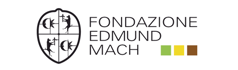

 

### 
4th EUROMAMMALS Summer School - University of Aveiro, Portugal    July 6th - 10th, 2020

# 
Data Management in Movement Ecology 2020
  

Data management is increasingly becoming a necessary skill for ecologists, as has already happened with statistics and GIS. This is especially true for movement ecology that can exploit data sets of ever increasing size, frequency and resolution from tagging techniques. These data come with complex associated information related to the animal characteristics, interactions and management and to the environmental context, such as population density, weather, habitat types and vegetation indexes based on remote sensing.  
This course has the objective to learn how to handle, model, store, and process in a robust and efficient way animal ecology data, and particularly the spatio-temporal information linked with movement data.  
These objectives will be pursued through a hands-on, step by step approach during an intense one-week course with a mix of technical lectures and hands-on exercises to manage and manipulate ecological data typically used in Movement Ecology.  
Proficiently following the course will provide participants with solid skills in management and analysis of ecological spatio-temporal data. At the end of the course the participants:  
* will be capacitated to use (spatial) database to store and manage their ecological data sets;  
* will master SQL and spatial SQL to retrieve and process their data;  
* will be able to use advanced animal movement database;  
* can use R in connection with a database to analyse their data.  

#### VENUE  
[University of Aveiro](https://www.ua.pt/), [Department of Biology (Building 8](documents/images/2020_CampusAveiro.pdf)) - Portugal

#### DATES  
**Summer School**: July 06th - 10th, 2020  
**Registration Deadline**: **May 15th, 2020**  
**Notification of Acceptance**:  May 30th, 2020

#### ORGANIZERS  
Carlos Fonseca, University of Aveiro  
Rita Torres, University of Aveiro  
Francesca Cagnacci, Research and Innovation Centre - Fondazione Edmund Mach  

#### TEACHERS
Ferdinando Urbano (environmental analyst, Euromammals)  
Emiel van Loon (quantitative ecologist, University of Amsterdam)  
Francesca Cagnacci (movement ecologist, Fondazione Edmund Mach)  
Federico Ossi (wildlife biologist, University of Trento)  
Paola Semenzato (data manager, DREAm - Italy)  
Johannes De Groeve (data analyst, University of Amsterdam)  

#### EVALUATION AND CREDITS  
**ECTS credits** will be assigned, after positive grades in a final exam.  

#### PROGRAM
* Introduction to Data Management in Animal Ecology (*3 hours*)  
* SQL and Spatial SQL (*16 hours*)  
* Cleaning and Storing an Ecological Dataset into a Database (*6 hours*)  
* Movement Ecology Data Management in PostgreSQL/PostGIS (*6 hours*)  
* Movement Ecology Data Analysis in R (*6 hours*)  

The complete **program** is available [here](https://github.com/feurbano/data_management_2020/blob/master/documents/program.md) ([PDF file](https://github.com/feurbano/data_management_2020/blob/master/documents/pdf/COURSE_2020_program.pdf))  
The detailed **schedule** is available [here](https://github.com/feurbano/data_management_2020/blob/master/documents/schedule.md) ([PDF file](https://github.com/feurbano/data_management_2020/blob/master/documents/pdf/COURSE_2020_schedule.pdf))  

#### PARTICIPATION  
This course targets PhD students, but participation of post-docs, researchers, managers and motivated MSc is also fostered. There will be room for a maximum of 25 participant.  
#### FEES AND COSTS  
Free for PhD students from Aveiro and Lisbon.  
Students: 300€.  
Researchers/Managers: 450€.  
Lodging possibilities are available [inside the university](https://www.ua.pt/sas/cincobicas) or in the area. You can contact Rita Torres (rita.torres@ua.pt) for more information about accommodations and logistics.

#### REGISTRATION
Send an Email (subject: Data Management Movement Ecology 2020), containing a brief description of your PhD project and/or description of the relevance of the course to your research, along with a CV to Francesca Cagnacci (francesca.cagnacci@fmach.it) and Rita Torres (rita.torres@ua.pt).  
#### LOCATION  
District capital, the city of Aveiro is located in the Central Region of Portugal (Baixo Vouga) and has around 55,000 inhabitants. The city is evenly distributed over the lagoon landscape, since the Ria de Aveiro penetrates the urban space, crossed by a network of channels through which *moliceiros* (local colourful vessels) meander. Visiting on foot does not mean too much effort either since the city is flat, and anyone who enjoys cycling can take a *BUGA* - bicycles made freely available by Aveiro City Council. The São Jacinto Dunes Natural Reserve is about 15 minutes away, with its almost wild beaches. On the other side of the lagoon 10 km from Aveiro, Praia da Barra is a beautiful and spacious sandy beach with perfect conditions for night life and for a range of sports including surfing, bodyboarding, kite-surfing, sailing and sea fishing. For more detailed information see https://www.visitportugal.com/.
#### HOW TO REACH THE UNIVERSITY OF AVEIRO

From **Lisboa**, there are frequent direct trains to Aveiro from the Oriente or Santa Apolónia stations. The journey takes around 2 hours 30 minutes. By car the journey takes about 2 hours 30 minutes (254 km).  

From **Porto**, there are frequent direct trains to Aveiro from Campanhã or São Bento stations. The journey takes 50 minutes. By car the journey takes about 50 minutes (75 km).

---

### LESSONS MATERIAL AND SCHEDULE  

* **[Program](https://github.com/feurbano/data_management_2020/blob/master/documents/program.md)** - [PDF file](https://github.com/feurbano/data_management_2020/blob/master/documents/pdf/COURSE_2020_program.pdf)  
* **[Schedule](https://github.com/feurbano/data_management_2020/blob/master/documents/schedule.md)** - [PDF file](https://github.com/feurbano/data_management_2020/blob/master/documents/pdf/COURSE_2020_schedule.pdf)
* **[Data](https://github.com/feurbano/data_management_2020/blob/master/sections/data)**  - *work in progress*  
* **Section 1:** **[Introduction to Data Management in Animal Ecology](https://github.com/feurbano/data_management_2020/tree/master/sections/section_1)**  - *work in progress*
* **Section 2:** **[SQL and Spatial SQL](https://github.com/feurbano/data_management_2020/tree/master/sections/section_2/lesson_02.md)**  - *work in progress*
* **Section 3:**  **[Cleaning and Storing an Ecological Dataset into a Database](https://github.com/feurbano/data_management_2020/tree/master/sections/section_3/lesson_03.md)**  - *work in progress*
* **Section 4:** **[Movement Ecology Data Management in PostgreSQL/PostGIS](https://github.com/feurbano/data_management_2020/blob/master/sections/section_4//lesson_04.md)**  - *work in progress*
* **Section 5:** **[Movement Ecology Data Analysis in R](https://github.com/feurbano/data_management_2020/blob/master/sections/section_5)**  - *work in progress*
* **[Flash Talks from Students](https://github.com/feurbano/data_management_2020/blob/master/sections/talks)**
